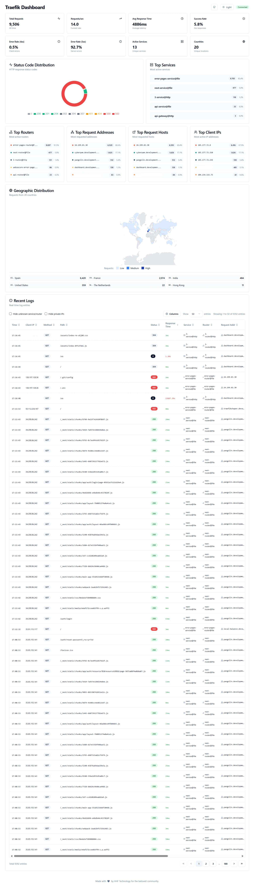
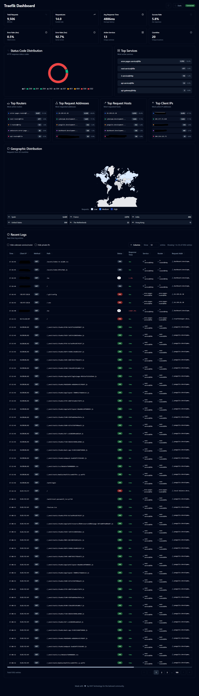

# Traefik Log Dashboard

A real-time dashboard for analyzing Traefik logs and OpenTelemetry traces with IP geolocation, status code analysis, and service metrics. Built with React (Shadcn UI) and Go backend.




## Features

- **Real-time Monitoring**: Live updates via WebSocket
- **OpenTelemetry OTLP Support**: Direct telemetry receiver for real-time traces from Traefik
- **Hybrid Data Sources**: Support both log file parsing and OTLP traces
- **IP Geolocation**: Track requests by country and city with MaxMind GeoIP2 support
- **Comprehensive Analytics**: Request rates, response times, status codes, error monitoring
- **Modern UI**: Built with Shadcn UI components and real-time charts
- **Advanced Filtering**: Hide unknown services, private IPs, with pagination support
- **IPv6 Support**: Proper handling of IPv6 addresses
- **Multiple Log Sources**: Monitor multiple Traefik instances simultaneously
- **Containerized**: Easy deployment with Docker Compose

## Quick Start

### Option 1: OpenTelemetry (Recommended - Real-time)
```bash
# Clone repository
git clone https://github.com/hhftechnology/traefik-log-dashboard.git
cd traefik-log-dashboard

# Configure for OTLP
cp .env.example .env
# Edit .env: Set OTLP_ENABLED=true

# Start with OTLP support
docker compose -f docker-compose-otlp.yml up -d

# Access dashboard
open http://localhost:3000
```

### Option 2: Log File Parsing (Traditional)
```bash
# Configure for log files
cp .env.example .env
# Edit .env: Set TRAEFIK_LOG_PATH=/path/to/logs

# Start with standard setup
docker compose up -d
```

### Option 3: Hybrid Mode (Both OTLP + Log Files)
```bash
# Enable both data sources
# .env: OTLP_ENABLED=true AND TRAEFIK_LOG_PATH=/path/to/logs
docker compose -f docker-compose-otlp.yml up -d
```

## File Structure

```
traefik-log-dashboard/
├── README.md
├── .env.example                    # Environment configuration template
├── docker-compose.yml              # Standard deployment (log files)
├── docker-compose-otlp.yml         # Enhanced deployment with OTLP
├── traefik-otlp-config.yaml       # Traefik configuration with OTLP
├── backend/
│   ├── Dockerfile
│   ├── main.go
│   ├── logParser.go
│   ├── otlp.go                     # OpenTelemetry receiver
│   ├── websocket.go
│   ├── geoLocation.go
│   └── fileWatcher.go
├── frontend/
│   ├── Dockerfile
│   ├── src/
│   │   ├── components/
│   │   │   ├── Dashboard.tsx
│   │   │   ├── LogTable.tsx
│   │   │   ├── StatsCards.tsx
│   │   │   └── GeoMap.tsx
│   │   └── hooks/
│   │       └── useWebSocket.tsx
└── scripts/
    └── dashboard-preview images
```

## Configuration

### Environment Variables (.env)

```env
# Traefik Log Files (optional if using OTLP only)
TRAEFIK_LOG_PATH=/path/to/traefik/logs

# OpenTelemetry Configuration  
OTLP_ENABLED=true
OTLP_GRPC_PORT=4317
OTLP_HTTP_PORT=4318

# Basic Settings
PORT=3001
FRONTEND_PORT=3000

# MaxMind GeoIP (optional but recommended)
USE_MAXMIND=true
MAXMIND_DB_PATH=/maxmind/GeoLite2-City.mmdb
MAXMIND_FALLBACK_ONLINE=true

# Performance Tuning
GOGC=50
GOMEMLIMIT=500MiB
```

### Traefik Configuration with OTLP

Create `traefik.yml` with OpenTelemetry support:

```yaml
# traefik.yml
api:
  dashboard: true

entryPoints:
  web:
    address: ":80"
  websecure:
    address: ":443"

providers:
  docker:
    exposedByDefault: false

# OpenTelemetry Tracing
tracing:
  otlp:
    http:
      endpoint: "http://dashboard-backend:4318/v1/traces"
    # Alternative: GRPC for better performance
    # grpc:
    #   endpoint: "dashboard-backend:4317"
    #   insecure: true
  sampleRate: 1.0  # Adjust for production (0.1 = 10%)

# Traditional JSON logging (optional alongside OTLP)
accessLog:
  filePath: "/logs/access.log"
  format: json
```

## Usage Examples

### Development Setup
```bash
# Full tracing with debug logs
docker compose -f docker-compose-otlp.yml -f docker-compose.dev.yml up -d
```

### Production Setup  
```bash
# Optimized with reduced sampling
docker compose -f docker-compose-otlp.yml -f docker-compose.prod.yml up -d
```

### Testing with Sample Traffic
```bash
# Start with sample applications
docker compose -f docker-compose-otlp.yml --profile testing up -d

# Generate test traffic
curl -H "Host: app.localhost" http://localhost/
```

## MaxMind GeoIP Setup

1. **Get MaxMind License Key**
   - Sign up at https://www.maxmind.com/en/geolite2/signup
   - Generate a license key

2. **Download Database**
   ```bash
   # Set your license key
   export MAXMIND_LICENSE_KEY=your_license_key_here
   
   # Download database
   make maxmind-download
   ```

3. **Configure**
   ```env
   USE_MAXMIND=true
   MAXMIND_DB_PATH=/maxmind/GeoLite2-City.mmdb
   ```

## API Reference

### OTLP Endpoints
- `GET /api/otlp/status` - Check OTLP receiver status
- `POST /api/otlp/start` - Start OTLP receiver
- `POST /api/otlp/stop` - Stop OTLP receiver

### Dashboard APIs
- `GET /api/stats` - Get aggregated statistics
- `GET /api/logs` - Get paginated logs with filters
- `GET /api/geo-stats` - Geographic statistics
- `WebSocket /ws` - Real-time log streaming

### Health Checks
- `GET /health` - Application health status

## Troubleshooting

### OTLP Not Receiving Data
1. Check OTLP status: `curl http://localhost:3001/api/otlp/status`
2. Verify Traefik configuration points to correct endpoint
3. Ensure sampling rate > 0 in Traefik config
4. Check network connectivity between containers

### Log Files Not Loading
1. Verify log file path in `.env`
2. Ensure Traefik outputs JSON format
3. Check container logs: `docker compose logs backend`

### Performance Issues
1. Reduce sampling rate in Traefik: `sampleRate: 0.1`
2. Use GRPC instead of HTTP for OTLP
3. Optimize backend settings:
   ```env
   MAX_LOGS_IN_MEMORY=5000
   GOGC=20
   ```

### WebSocket Disconnections
1. Check firewall settings
2. Verify proxy supports WebSocket connections
3. Review nginx configuration in frontend container

## Development

### Local Development
```bash
# Backend
cd backend
go run *.go

# Frontend  
cd frontend
npm install && npm run dev
```

### Environment-Specific Deployments

**Development**: Full tracing, debug logs
```bash
docker compose -f docker-compose-otlp.yml -f docker-compose.dev.yml up
```

**Production**: Optimized performance, reduced sampling
```bash
docker compose -f docker-compose-otlp.yml -f docker-compose.prod.yml up -d
```

## Performance Considerations

- **High Traffic**: Use GRPC OTLP endpoint and reduce sampling rate
- **Memory Usage**: Limit logs in memory with `MAX_LOGS_IN_MEMORY`
- **GeoIP**: Use MaxMind offline database for better performance
- **WebSocket**: Monitor connection count and implement rate limiting

## Security

- **Production**: Disable API dashboard and use HTTPS
- **Network**: Use internal Docker networks for OTLP endpoints
- **Privacy**: Set `MAXMIND_FALLBACK_ONLINE=false` to prevent external calls
- **Sampling**: Use low sampling rates for sensitive applications

## Architecture

```
┌─────────────────┐    OTLP     ┌─────────────────┐    WebSocket    ┌──────────────┐
│     Traefik     │──────────▶ │   Dashboard     │ ──────────────▶ │   Frontend   │
│    (Traces)     │ HTTP/GRPC   │   Backend       │   Real-time     │   (React)    │
└─────────────────┘             │   (Go)          │                 └──────────────┘
                                │                 │
┌─────────────────┐    Files    │   ┌─────────────┤
│   Log Files     │──────────▶  │   │ OTLP        │
│   (Optional)    │   Parsing   │  │ Receiver    │
└─────────────────┘             │  │             │
                                │  └─────────────┤
┌─────────────────┐    Cache    │                │
│    MaxMind      │◀───────────▶│  Log Parser    │
│    (GeoIP)      │   Lookup    │  (Unified)     │
└─────────────────┘             └────────────────┘
```

## Support

For issues or questions:
1. Check troubleshooting section
2. Review logs: `docker compose logs -f`
3. Test endpoints manually
4. Open GitHub issue with logs and configuration

## License

MIT License - See LICENSE file for details.

## Contributing

1. Fork the repository
2. Create feature branch
3. Make changes with tests
4. Submit pull request

---
