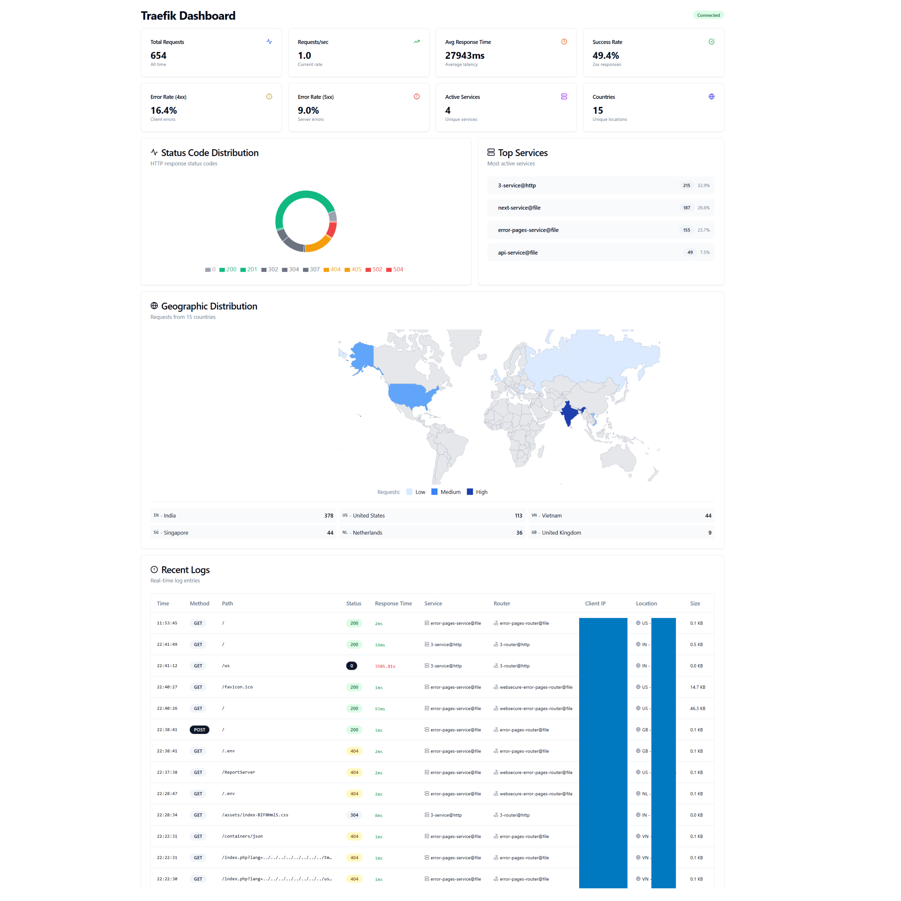

# Traefik Log Dashboard

A real-time dashboard for analyzing Traefik logs with IP geolocation, status code analysis, and service metrics. Built with React (Shadcn UI) and Node.js.



## Features

- **Real-time Log Monitoring**: Live updates via WebSocket
- **IP Geolocation**: Track requests by country and city
- **Comprehensive Analytics**: 
  - Request rate and response times
  - Status code distribution
  - Service and router statistics
  - Error rate monitoring
- **Modern UI**: Built with Shadcn UI components
- **Containerized**: Easy deployment with Docker
- **Auto-refresh**: Stats update every 5 seconds

## Prerequisites

- Docker and Docker Compose
- Traefik configured with JSON logging
- Access to Traefik log files

## Quick Start

1. **Clone the repository**
   ```bash
   git clone https://github.com/yourusername/traefik-log-dashboard.git
   cd traefik-log-dashboard
   ```

2. **Configure log file path**
   
   Create a `.env` file:
   ```env
   TRAEFIK_LOG_PATH=/path/to/your/traefik/logs
   ```

3. **Build and run**
   ```bash
   docker-compose up -d
   ```

4. **Access the dashboard**
   
   Open http://localhost:3000 in your browser

## Configuration

### Traefik Configuration

Ensure Traefik is configured to output JSON logs:

```yaml
# traefik.yml
accessLog:
  filePath: /logs/traefik.log
  format: json
  fields:
    defaultMode: keep
    headers:
      defaultMode: keep
```

### Environment Variables

| Variable | Description | Default |
|----------|-------------|---------|
| `TRAEFIK_LOG_PATH` | Path to Traefik log file/directory | `./logs` |
| `PORT` | Backend API port | `3001` |

### Docker Compose Options

The `docker-compose.yml` file supports several deployment scenarios:

1. **Single log file**:
   ```yaml
   volumes:
     - /path/to/traefik.log:/logs/traefik.log:ro
   ```

2. **Log directory**:
   ```yaml
   volumes:
     - /path/to/log/directory:/logs:ro
   ```

3. **Named volume** (if using Traefik in Docker):
   ```yaml
   volumes:
     - traefik-logs:/logs:ro
   ```

## Architecture

```
┌─────────────────┐     ┌─────────────────┐
│                 │     │                 │
│  Frontend       │────▶│  Backend API    │
│  (React/Vite)   │ WS  │  (Node.js)      │
│                 │     │                 │
└─────────────────┘     └────────┬────────┘
                                 │
                                 ▼
                        ┌─────────────────┐
                        │                 │
                        │  Traefik Logs   │
                        │  (JSON Format)  │
                        │                 │
                        └─────────────────┘
```

## API Endpoints

- `GET /api/stats` - Get aggregated statistics
- `GET /api/logs` - Get paginated logs with filters
- `GET /api/services` - List all services
- `GET /api/routers` - List all routers
- `GET /api/geo-stats` - Geographic statistics
- `POST /api/set-log-file` - Change log file location
- `WebSocket /` - Real-time log streaming

## Development

### Local Development

1. **Backend**:
   ```bash
   cd backend
   npm install
   npm run dev
   ```

2. **Frontend**:
   ```bash
   cd frontend
   npm install
   npm run dev
   ```

### Building from Source

```bash
# Build backend
cd backend
docker build -t traefik-dashboard-backend .

# Build frontend
cd frontend
docker build -t traefik-dashboard-frontend .
```

## Customization

### Adding Custom Metrics

1. Edit `backend/src/logParser.js` to extract additional fields
2. Update `frontend/src/components/StatsCards.tsx` to display new metrics

### Modifying UI Theme

Edit `frontend/src/index.css` to customize colors and styling.

## Performance Considerations

- The backend keeps the last 10,000 logs in memory
- IP geolocation results are cached for 24 hours
- Stats are calculated incrementally for efficiency
- WebSocket connections automatically reconnect

## Troubleshooting

### Dashboard shows "No logs found"

1. Check Traefik log file path in `.env`
2. Ensure Traefik is outputting JSON format
3. Check container logs: `docker-compose logs backend`

### WebSocket connection fails

1. Check if backend is running: `curl http://localhost:3001/health`
2. Ensure ports 3000 and 3001 are not in use
3. Check browser console for errors

### Geolocation not working

- The dashboard uses ip-api.com (free tier: 45 requests/minute)
- Private IPs show as "Private Network"
- Rate limits may apply for high-traffic sites


### Step 1: Create all directories

```bash
mkdir -p traefik-log-dashboard/{backend/src,frontend/src/{components/ui,hooks,lib},monitoring,scripts,.github/workflows}
cd traefik-log-dashboard
```

### Step 2: Copy all files

Copy each file from the artifacts to its corresponding location in the directory structure.

### Step 3: Configure environment

```bash
cp .env.example .env
# Edit .env and set TRAEFIK_LOG_PATH to your log location
```

### Step 4: Build and run

```bash
# Using Make
make build
make up

# Or using Docker Compose directly
docker-compose build
docker-compose up -d
```

## Configuration Options

### Environment Variables

| Variable | Description | Default | Example |
|----------|-------------|---------|---------|
| `TRAEFIK_LOG_PATH` | Path to Traefik logs | `/logs` | `/var/log/traefik/access.log` |
| `PORT` | Backend API port | `3001` | `3001` |
| `FRONTEND_PORT` | Frontend port | `3000` | `8080` |
| `NODE_ENV` | Environment | `production` | `development` |

### Traefik Log Format

The dashboard expects Traefik logs in JSON format. Configure Traefik:

```yaml
# traefik.yml
accessLog:
  filePath: "/path/to/access.log"
  format: json
```

## Features Overview

### Real-time Monitoring
- Live log streaming via WebSocket
- Auto-reconnect on connection loss
- Updates every 5 seconds

### Analytics
- Total requests & requests/second
- Average response time
- Status code distribution
- Error rates (4xx, 5xx)
- Service & router statistics
- Geographic distribution

### Log Analysis
- Searchable log table
- Filter by service, status, router
- IP geolocation with country/city
- Response time color coding
- Request method badges

## Docker Deployment Options

### Basic Deployment
```bash
docker-compose up -d
```

### Development Mode
```bash
docker-compose -f docker-compose.yml -f docker-compose.dev.yml up
```

### Production Mode
```bash
docker-compose -f docker-compose.yml -f docker-compose.prod.yml up -d
```

### With Monitoring
```bash
docker-compose -f docker-compose.yml -f docker-compose.monitoring.yml up -d
```

## Testing

### Generate Sample Logs
```bash
# Generate 1000 sample logs
node scripts/generate-sample-logs.js logs/traefik.log 1000

# Generate continuous logs
node scripts/generate-sample-logs.js logs/traefik.log 0 --continuous
```

### Health Checks
```bash
# Check backend health
curl http://localhost:3001/health

# Check frontend
curl http://localhost:3000
```

## Troubleshooting

### Dashboard shows "No logs found"

1. Check log file path:
   ```bash
   docker-compose exec backend ls -la /logs
   ```

2. Verify log format is JSON:
   ```bash
   docker-compose exec backend head -n 1 /logs/traefik.log
   ```

3. Check backend logs:
   ```bash
   docker-compose logs backend
   ```

### WebSocket disconnects frequently

1. Check nginx configuration in frontend container
2. Ensure firewall allows WebSocket connections
3. Check for proxy/load balancer WebSocket support

### High memory usage

1. Reduce `maxLogs` in `backend/src/logParser.js`
2. Add memory limits in `docker-compose.prod.yml`
3. Enable log rotation in Traefik

## Production Deployment

### With SSL/TLS

1. Use Traefik as reverse proxy:
```yaml
labels:
  - "traefik.enable=true"
  - "traefik.http.routers.dashboard.rule=Host(`dashboard.example.com`)"
  - "traefik.http.routers.dashboard.tls=true"
  - "traefik.http.routers.dashboard.tls.certresolver=letsencrypt"
```

2. Or use nginx with Let's Encrypt:
```bash
# Install certbot and obtain certificate
certbot certonly --webroot -w /var/www/html -d dashboard.example.com
```

### Authentication

Add basic auth with Traefik:
```yaml
labels:
  - "traefik.http.routers.dashboard.middlewares=auth"
  - "traefik.http.middlewares.auth.basicauth.users=admin:$$2y$$10$$..."
```

### Monitoring

Access monitoring tools:
- Prometheus: http://localhost:9090
- Grafana: http://localhost:3001 (admin/admin)

## API Reference

### REST Endpoints

```bash
# Get statistics
curl http://localhost:3001/api/stats

# Get logs with pagination
curl http://localhost:3001/api/logs?page=1&limit=50

# Filter logs
curl http://localhost:3001/api/logs?service=api-gateway&status=200

# Get services list
curl http://localhost:3001/api/services

# Get geographic stats
curl http://localhost:3001/api/geo-stats
```

### WebSocket Events

Connect to `ws://localhost:3001` and receive:
- `newLog` - Individual log entries
- `stats` - Updated statistics
- `logs` - Batch of logs


For more help, create an issue on GitHub or check the logs:
```bash
docker-compose logs -f --tail=100
```
# Traefik Log Dashboard - Quick Reference

## Quick Commands

```bash
# Start
./setup.sh                    # First time setup
docker-compose up -d          # Start services
make up                       # Alternative: using Makefile

# Stop
docker-compose down           # Stop services
make down                     # Alternative: using Makefile

# Logs
docker-compose logs -f        # View all logs
docker-compose logs backend   # Backend logs only
docker-compose logs frontend  # Frontend logs only

# Restart
docker-compose restart        # Restart all services
make restart                  # Alternative: using Makefile

# Update
git pull                      # Get latest code
docker-compose build --no-cache  # Rebuild images
docker-compose up -d          # Restart with new images
```

## 🔍 Common Issues & Solutions

| Issue | Solution |
|-------|----------|
| No logs showing | Check `TRAEFIK_LOG_PATH` in `.env` |
| Can't connect | Ensure ports 3000 & 3001 are free |
| High memory | Reduce log retention in `logParser.js` |
| WebSocket fails | Check firewall/proxy settings |

## 📊 API Quick Test

```bash
# Test backend health
curl http://localhost:3001/health

# Get current stats
curl http://localhost:3001/api/stats | jq .

# Get recent logs
curl http://localhost:3001/api/logs?limit=10 | jq .
```

## Docker Commands

```bash
# View running containers
docker-compose ps

# Enter backend container
docker-compose exec backend sh

# Enter frontend container
docker-compose exec frontend sh

# View resource usage
docker stats

# Clean up everything
docker-compose down -v --rmi all
```

## Important Files

- `.env` - Configuration
- `docker-compose.yml` - Service definitions
- `backend/src/logParser.js` - Log parsing logic
- `frontend/src/components/Dashboard.tsx` - Main UI

## URLs

- Dashboard: http://localhost:3000
- Backend API: http://localhost:3001
- Health Check: http://localhost:3001/health

## Development

```bash
# Start dev mode with hot reload
docker-compose -f docker-compose.yml -f docker-compose.dev.yml up

# Generate test logs
node scripts/generate-sample-logs.js logs/traefik.log 100

# Continuous test logs
node scripts/generate-sample-logs.js logs/traefik.log 0 --continuous
```

## Monitoring (Optional)

```bash
# Start with monitoring
docker-compose -f docker-compose.yml -f docker-compose.monitoring.yml up -d

# Access
# - Prometheus: http://localhost:9090
# - Grafana: http://localhost:3001 (admin/admin)
```

---
Need help? Check logs first: `docker-compose logs -f`

## Contributing

1. Fork the repository
2. Create feature branch: `git checkout -b feature/amazing-feature`
3. Commit changes: `git commit -m 'Add amazing feature'`
4. Push to branch: `git push origin feature/amazing-feature`
5. Open Pull Request

## License

MIT License - feel free to use in personal and commercial projects.

## Credits

- Built with React + TypeScript
- UI components from Shadcn UI
- Charts by Recharts
- IP geolocation by ip-api.com
- Icons by Lucide

---